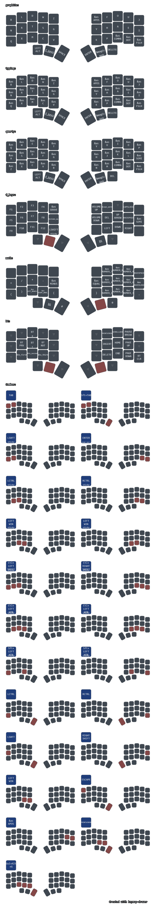

# zmk-config-corne-chocofi-with-niceview

ZMK firmware configuration for a wireless Chocofi split keyboard.

## Hardware

| Component | Details |
|---|---|
| Controller | nice!nano v2 (both halves) |
| Layout | Corne / 5-column (36 keys) |
| Switches | [Robin (Choc V1)](https://a.co/d/01RhqsET) |

## Keymap

Uses the **Graphite** layout as the base layer. See the [Graphite layout reference](https://github.com/rdavison/graphite-layout) for more detail.

### Layers

| # | Name | Description |
|---|---|---|
| 0 | `graphite` | Base layer — Graphite layout, no autoshift |
| 1 | `typing` | Graphite with autoshift on all alpha keys |
| 2 | `qwerty` | QWERTY with autoshift, for guests |
| 3 | `f_keys` | F1–F12, volume, arrows, caps word |
| 4 | `math` | Numpad, operators, brackets |
| 5 | `bt` | Bluetooth selection, layer switching, media keys |

### Key Features

**Autoshift** — Hold any key slightly longer to produce its shifted character. Implemented via `as_ht` hold-tap behavior with a 170ms tapping term.

**Magic Key** — Adaptive key on the right thumb that outputs context-sensitive completions based on the previously typed key (e.g. `a` → `ation`, `i` → `ion`, `space` → `the `). Falls back to key repeat if no rule matches.

### Magic Key Completions

| Previous Key | Output |
|---|---|
| `a` | `tion` |
| `b` | `efore` |
| `c` | `tion` |
| `d` | `ition` |
| `e` | `u` |
| `f` | `y` |
| `g` | `s` |
| `h` | `y` |
| `i` | `on` |
| `j` | `ust` |
| `l` | `ation` |
| `m` | `ent` |
| `n` | `ion` |
| `o` | `a` |
| `p` | `h` |
| `q` | `uen` |
| `r` | `l` |
| `s` | `c` |
| `t` | `ment` |
| `u` | `e` |
| `v` | `er` |
| `w` | `s` |
| `y` | `'` |
| `z` | `ation` |
| `space` | `the ` |
| *(anything else)* | key repeat |

## Building

Firmware is built via GitHub Actions on push. Artifacts are attached to each workflow run. 

In GitHub, select Actions (enable then after Forking), select the Commit, select the Merge Output Artifacts step, expand the Merge Artifacts substep, line 32 will have a link with the files.

To build locally, follow the [ZMK getting started guide](https://zmk.dev/docs/development/setup).

## Notes

- Matrix transform uses `five_column_transform` (no outer pinky column)
- `lt` tapping term reduced to 170ms for snappier layer-tap response
- Magic Key is quicker, at 150ms

## Visuals

